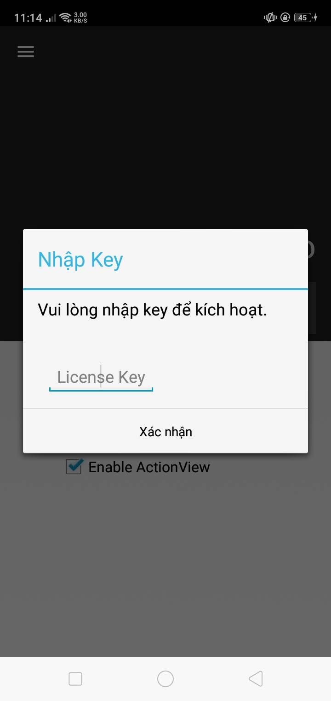
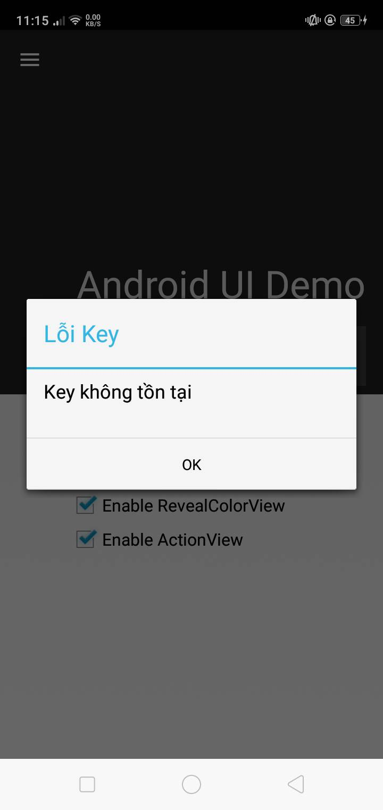
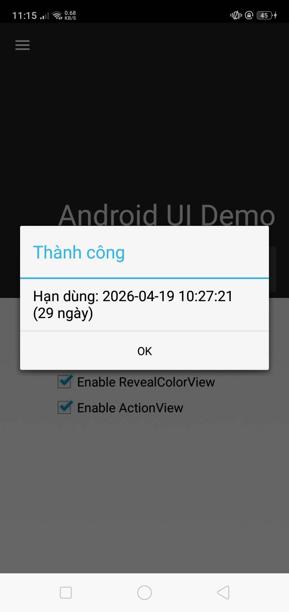

# AMDAPIKey — iOS & Android License Key

Mã hóa AES-256-CBC + HMAC-SHA256, chống replay attack, device binding.

---

## iOS

### Sử dụng

**1.** Copy 3 file vào project:

```
Project/
├── AMDAPIKey.h
├── AMDAPIKey.mm
└── libAMDAPIKey.a
```

**2.** Mở `AMDAPIKey.mm`, điền thông tin được cấp:

```objc
static NSString *const kPackageToken = @"..."; // app secret được cấp
static NSString *const kAppVersion = @"1.0.0"; // phiên bản
static NSString *const kTargetBundle = @"com.example.yourapp"; // bundle app
```

**3.** Thêm vào `Makefile`:

```makefile
YourTweak_FILES += AMDAPIKey.mm
YourTweak_CFLAGS += -fobjc-arc
YourTweak_LDFLAGS += -L$(THEOS_PROJECT_DIR) -lAMDAPIKey
```

Lưu ý: mọi thứ phải trùng với trên web

---

## Android

### Yêu cầu

- JDK 8+
- Android SDK (có `d8`)
- apktool

### Sử dụng

**1.** Copy 3 file vào project:

```
Project/
├── AMDAPIKey.java
├── AMDAPIKeyConfig.java
└── AMDAPIKeyHook.java
```

**2.** Mở `AMDAPIKeyConfig.java`, điền thông tin được cấp:

```java
static final String PACKAGE_TOKEN = "..."; // app secret được cấp
static final String APP_VERSION = "1.0.0"; // phiên bản
static final String TARGET_PACKAGE = "com.example.yourapp"; // package app
```

**3.** Compile thành `.dex`:

```bash
# Compile .java → .class
javac -source 8 -target 8 \
  -cp android.jar \
  AMDAPIKey.java AMDAPIKeyConfig.java AMDAPIKeyHook.java

# Compile .class → .dex
d8 --output ./ AMDAPIKey.class AMDAPIKeyConfig.class AMDAPIKeyHook.class
```

**4.** Decompile APK target:

```bash
apktool d target.apk -o target_out
```

**5.** Copy `classes.dex` vào APK:

```bash
# Nếu APK có classes.dex → đặt tên classes2.dex
# Nếu đã có classes2.dex → đặt tên classes3.dex
cp classes.dex target_out/classes2.dex
```

**6.** Thêm INTERNET permission vào `AndroidManifest.xml` nếu chưa có:

```xml
<uses-permission android:name="android.permission.INTERNET"/>
```

**7.** Hook vào `onCreate()` của Activity chính trong file smali:

```smali
invoke-super {p0, p1}, Landroid/app/Activity;->onCreate(Landroid/os/Bundle;)V

# Thêm dòng này ngay sau invoke-super
invoke-static {p0}, Lsite/amdsystem/apikey/AMDAPIKeyHook;->init(Landroid/app/Activity;)V
```

**8.** Recompile + sign:

```bash
apktool b target_out -o target_modded.apk
# Sign bằng uber-apk-signer hoặc apksigner
```

Lưu ý: mọi thứ phải trùng với trên web

---

## Demo

<p align="left">
  
  
  
</p>

<p align="right">
  
  
  
</p>

---

## Bảo mật

| Tính năng | Chi tiết |
|---|---|
| Mã hóa request | AES-256-CBC + HMAC-SHA256 |
| Mã hóa response | AES-256-CBC + HMAC-SHA256 |
| Replay protection | Timestamp ±5 phút |
| Device binding | UUID gắn với key |

---

## License

Chỉ dùng cho mục đích cá nhân và học tập.  
Không được phép tái phân phối hoặc sử dụng thương mại khi chưa có sự đồng ý.

---

## Liên hệ nếu có bug

> Telegram: [@icecnguyen](https://t.me/icecnguyen)
