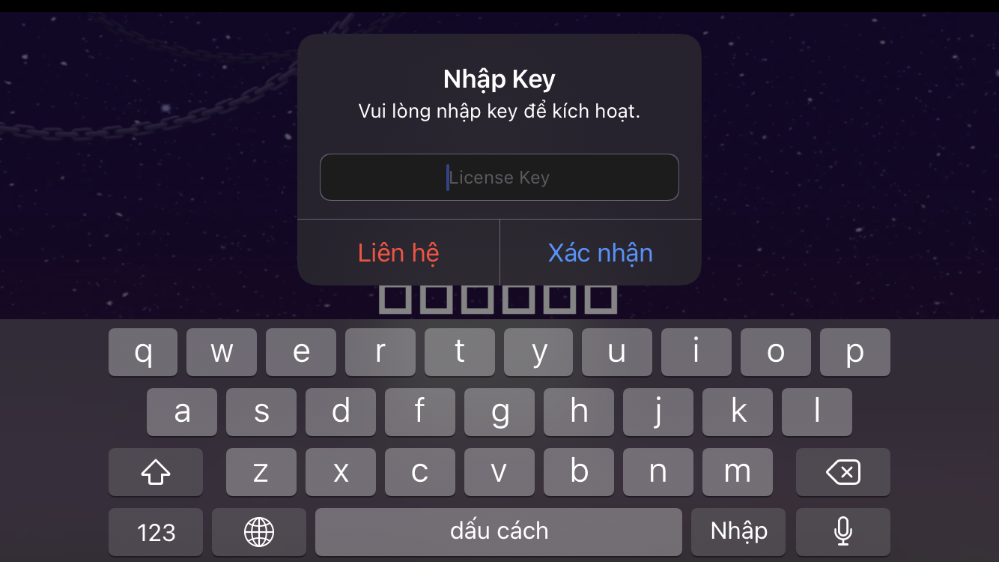
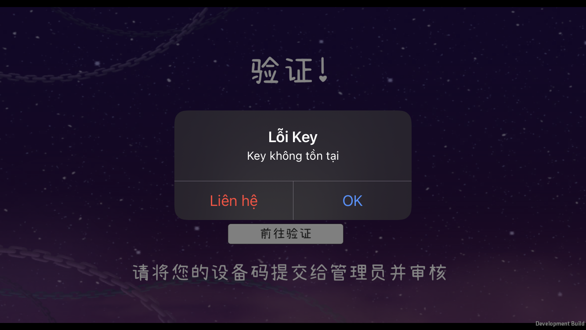
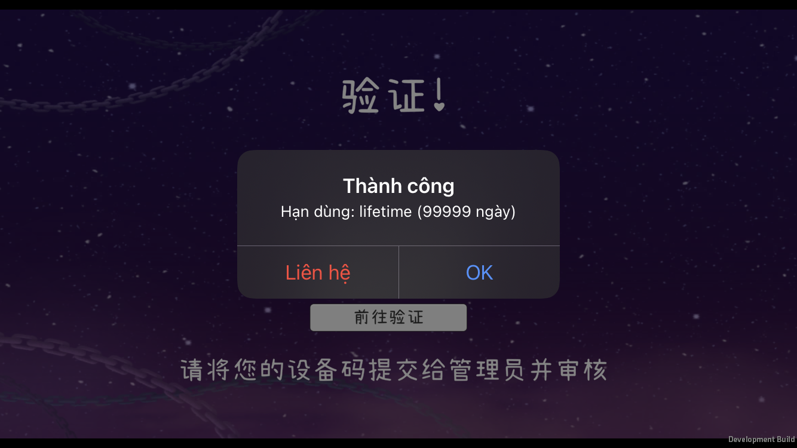

# AMDAPIKey — iOS License Key

Mã hóa AES-256-CBC + HMAC-SHA256, chống replay attack, device binding.

---

## Sử dụng

**1.** Copy 3 file vào project:

```
Project/
├── AMDAPIKey.h
├── AMDAPIKey.mm
└── libAMDAPIKey.a
```

**2.** Mở `AMDAPIKey.mm`, điền thông tin được cấp:

```objc
static NSString *const kPackageToken = @"..."; // app secret được cấp
static NSString *const kAppVersion = @"1.0.0"; // phiên bản
static NSString *const kTargetBundle = @"com.example.yourapp"; // bundle app
```

**3.** Thêm vào `Makefile`:

```makefile
YourTweak_FILES   += AMDAPIKey.mm
YourTweak_CFLAGS  += -fobjc-arc
YourTweak_LDFLAGS += -L$(THEOS_PROJECT_DIR) -lAMDAPIKey
```

Lưu ý: mọi thứ phải trùng với trên web

---

## Demo

<p align="center">
  
  
  
</p>

---

## Liên hệ

> Telegram: [@icecnguyen](https://t.me/icecnguyen)

---

## Bảo mật

| Tính năng | Chi tiết |
|---|---|
| Mã hóa request | AES-256-CBC + HMAC-SHA256 |
| Mã hóa response | AES-256-CBC + HMAC-SHA256 |
| Replay protection | Timestamp ±5 phút |
| Device binding | UUID gắn với key |

---
